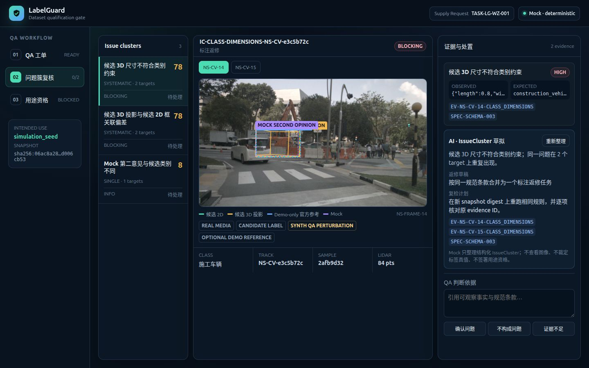
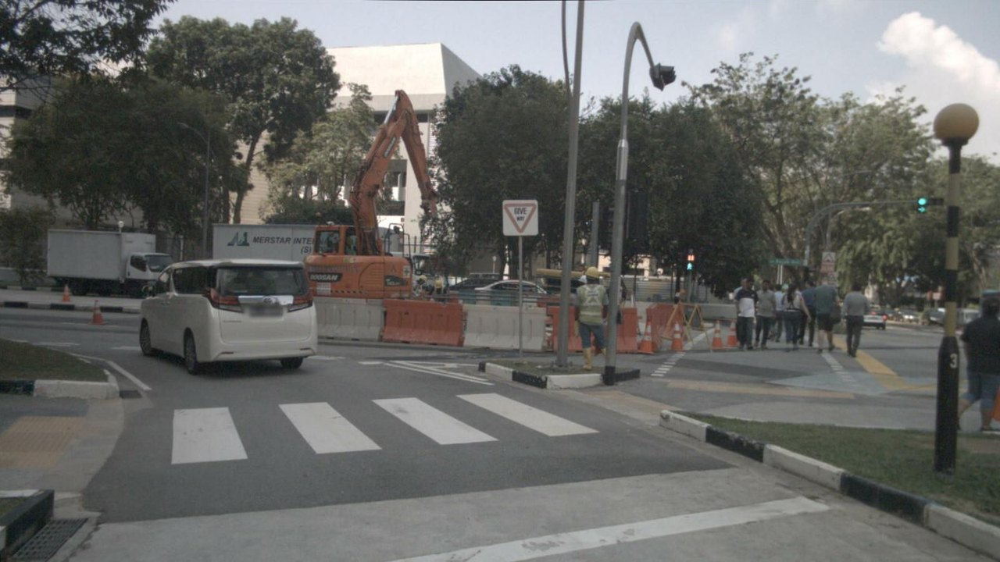
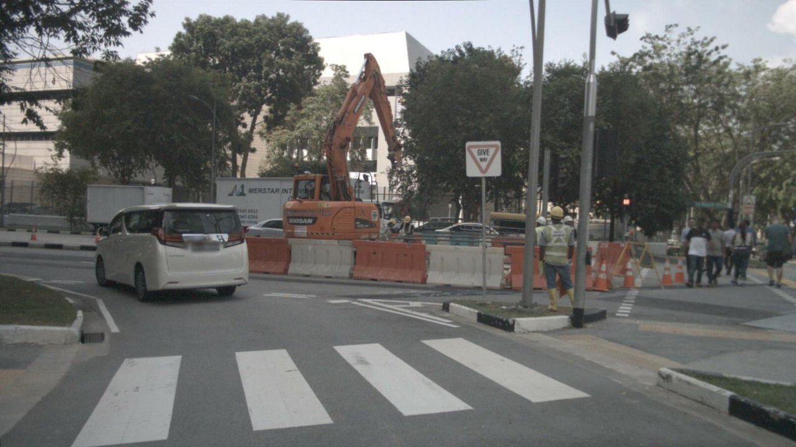
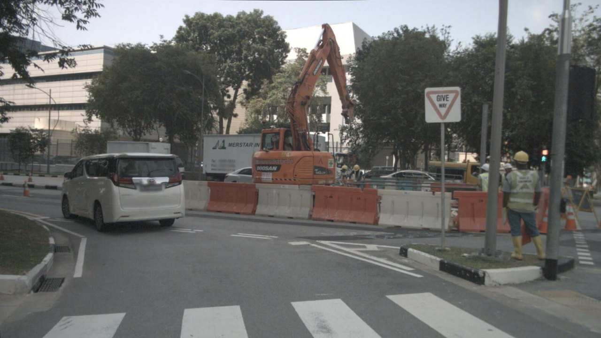

<div align="center">
  <p><strong>LABELGUARD</strong><br /><sub>面向特定用途的自动驾驶标签质量门禁</sub></p>
  <h1>签署的是快照，不是一句承诺。</h1>
  <p>
    将确定性检查、可复核证据、返修复检与人工签署<br />
    绑定到一个不可变候选数据集和一个已声明的下游用途。
  </p>
  <p>
    <a href="https://autoinsight-labelguard.pages.dev/"><strong>◉ 打开在线体验</strong></a>
    &nbsp;·&nbsp;
    <a href="README.md"><strong>English</strong></a>
    &nbsp;·&nbsp;
    <a href="docs/product-solution.md">产品方案</a>
    &nbsp;·&nbsp;
    <a href="docs/validation-report.md">验证报告</a>
  </p>
  <p>
    <code>DATA_QA</code>&nbsp;
    <code>不可变快照</code>&nbsp;
    <code>ISSUECLUSTER</code>&nbsp;
    <code>人工签署</code>
  </p>
</div>

<table>
  <tr>
    <td align="center"><strong>3</strong><br /><sub>帧真实 nuScenes 画面</sub></td>
    <td align="center"><strong>9</strong><br /><sub>个目标观测</sub></td>
    <td align="center"><strong>5</strong><br /><sub>个显式合成 QA 扰动</sub></td>
    <td align="center"><strong>3</strong><br /><sub>个可复核 IssueCluster</sub></td>
    <td align="center"><strong>1</strong><br /><sub>个限定用途：仿真种子</sub></td>
  </tr>
</table>

## 产品界面

<p align="center">
  <a href="https://autoinsight-labelguard.pages.dev/">
    <picture>
      
    </picture>
  </a>
</p>

<p align="center"><sub>线上 v2 问题簇复核页的实际 1440 × 900 截图：真实 nuScenes 画面、候选 2D / 候选 3D 投影、可选 Demo 参考与确定性 Mock 清晰分层，并与证据关联的人工处置控件同屏展示。</sub></p>

## LabelGuard 负责什么决策

LabelGuard 是 SceneQL 数据供给工作流中的 `DATA_QA` 执行路由。它**不**宣称一批数据在所有情况下都“正确”，不替代标注平台，也不把视觉模型当作真值。它只回答一个范围更窄、对生产真正有用的问题：

> **在这个版本化 Quality Profile 下，这个精确的候选快照是否满足已声明的下游用途？**

这个答案同时服务四类角色：QA Owner 获得可审计的签署门禁；数据生产经理获得合并后的返修范围；供应商获得与证据对应的返修说明；数据消费者获得机器可读、用途受限的质量回执。

## 用途质量门禁

<table>
  <tr>
    <td align="center" width="25%">
      <sub>01 · 绑定</sub><br />
      <strong>声明要做的决策</strong><br />
      <sub>预期用途 · Quality Profile · 范围 · 源 SHA-256</sub>
    </td>
    <td align="center" width="25%">
      <sub>02 · 检测</sub><br />
      <strong>运行确定性 QA</strong><br />
      <sub>候选几何 · 投影 · 轨迹连续性 · 传感器支持</sub>
    </td>
    <td align="center" width="25%">
      <sub>03 · 决策</sub><br />
      <strong>复核 IssueCluster</strong><br />
      <sub>目标 / 轨迹证据 · 闭集规范条款 · 人工判断</sub>
    </td>
    <td align="center" width="25%">
      <sub>04 · 放行</sub><br />
      <strong>复检并签署</strong><br />
      <sub>新快照 · 返修追溯 · QA Owner · Manifest + 回执</sub>
    </td>
  </tr>
  <tr>
    <td align="center">工单预检<br /><strong>READY</strong></td>
    <td align="center">重复发现聚类<br /><strong>ISSUECLUSTER</strong></td>
    <td align="center">在新摘要上完成处置<br /><strong>AWAITING_SIGNOFF</strong></td>
    <td align="center">人工显式批准<br /><strong>QUALIFIED</strong></td>
  </tr>
</table>

<table>
  <tr>
    <td align="center"><strong>↳ 安全失败</strong><br /><sub>工单字段缺失 → <code>NEEDS_CLARIFICATION</code></sub></td>
    <td align="center"><strong>↳ 阻断过期工作</strong><br /><sub>摘要变化 → <code>SNAPSHOT_CHANGED</code>；旧决定不得复用</sub></td>
    <td align="center"><strong>↳ 限定结论范围</strong><br /><sub>Manifest 只对签署的快照、用途和 Quality Profile 有效</sub></td>
  </tr>
</table>

## 逐帧查看真实证据

公开样例来自 nuScenes v1.0-mini `scene-0061` 的三个相邻 `CAM_FRONT` 关键帧。以下是实际路采画面；为了跑通 QA 流程而加入的受控扰动会被单独标为合成数据。

<table>
  <tr>
    <td width="33%"></td>
    <td width="33%"></td>
    <td width="33%"></td>
  </tr>
  <tr>
    <td align="center"><sub>关键帧 14 · CAM_FRONT</sub></td>
    <td align="center"><sub>关键帧 15 · CAM_FRONT</sub></td>
    <td align="center"><sub>关键帧 16 · CAM_FRONT</sub></td>
  </tr>
</table>

<p align="center"><sub>由 nuScenes v1.0-mini 派生，仅用于非商业演示。数据条款和署名信息保留在 <a href="public/demo/LICENSE">public/demo/LICENSE</a>。</sub></p>

## 证据分层，而不是混在一起

<table>
  <thead>
    <tr>
      <th align="left">数据层</th>
      <th align="left">来源</th>
      <th align="left">在复核中的作用</th>
      <th align="center">能否决定用途资格？</th>
    </tr>
  </thead>
  <tbody>
    <tr>
      <td>🟢 <strong>真实媒体</strong></td>
      <td>nuScenes 派生相机画面</td>
      <td>可观察的场景证据</td>
      <td align="center"><strong>不能</strong></td>
    </tr>
    <tr>
      <td>🟠 <strong>候选标注</strong></td>
      <td><code>candidate2d</code>、<code>candidate3d</code>、候选投影</td>
      <td>接受 QA 的生产式对象</td>
      <td align="center"><strong>不能</strong></td>
    </tr>
    <tr>
      <td>🔵 <strong>Demo 参考</strong></td>
      <td>可选 nuScenes 官方标注，标记为 <code>demoOnly</code></td>
      <td>解释公开样例；生产 schema 不依赖它</td>
      <td align="center"><strong>不能</strong></td>
    </tr>
    <tr>
      <td>🟣 <strong>第二意见</strong></td>
      <td>公开构建中的确定性 Mock</td>
      <td>仅供比较；缺失不会阻断当前 Profile</td>
      <td align="center"><strong>不能</strong></td>
    </tr>
    <tr>
      <td>⚪ <strong>人工决定</strong></td>
      <td>QA Owner + 证据绑定的 review bundle</td>
      <td>确认处置，并显式签署限定用途</td>
      <td align="center"><strong>可以</strong></td>
    </tr>
  </tbody>
</table>

## 快照与签署不变量

<table>
  <tr>
    <td align="center"><strong>S₀ · 候选快照</strong><br /><sub>规范化数据集 SHA-256</sub></td>
    <td align="center">→<br /><sub>复核</sub></td>
    <td align="center"><strong>决策包</strong><br /><sub>IssueCluster · evidence ID · spec-clause ID</sub></td>
    <td align="center">→<br /><sub>返修</sub></td>
    <td align="center"><strong>S₁ · 修正快照</strong><br /><sub>新摘要 + 范围内目标差异</sub></td>
    <td align="center">→<br /><sub>签署</sub></td>
    <td align="center"><strong>MANIFEST</strong><br /><sub>S₁ + 预期用途 + 复核人身份</sub></td>
  </tr>
</table>

- QA 开始前，工单摘要必须与系统计算的候选内容摘要一致。
- 人工决定绑定 `S₀`，绝不会在快照之间静默继承。
- 有效复检必须产生**新的规范化 SHA-256**，并逐目标映射回返修范围。
- 确定性检查通过后只进入 `AWAITING_SIGNOFF`，不会自动获得资格。
- 快照、决定或 review bundle 任一变化，都会让旧签署失效。

## AI 在哪里有用，又在哪里停下

<table>
  <tr>
    <td width="50%" valign="top">
      <h3>AI 辅助</h3>
      <ul>
        <li>把同一个 IssueCluster 的证据压缩成短摘要</li>
        <li>将已有证据映射到允许的闭集规范条款 ID</li>
        <li>草拟一次返修范围和一次复检计划</li>
      </ul>
    </td>
    <td width="50%" valign="top">
      <h3>确定性系统或人工负责</h3>
      <ul>
        <li>测量、阈值、投影和轨迹检查</li>
        <li>标签真值、严重度处置与返修批准</li>
        <li>快照修改、用途资格与 QA Owner 签署</li>
      </ul>
    </td>
  </tr>
</table>

公开站始终使用可复现的确定性 Mock，并在界面中明确标注。可选 MiniMax-M3 只在服务端运行，读取结构化 IssueCluster 上下文而不是图像，并且必须引用输入提供的 evidence ID 与规范条款 ID。JSON 无效、引用缺失或虚构 ID 时安全失败。

## Demo 范围与诚实边界

五个显式标记的合成扰动形成两个系统性阻断问题簇和一个 Mock 分歧信息簇。Demo 只演示 `simulation_seed` 用途资格；一键修正快照回执也明确为合成数据，生产部署必须导入并校验真实的返修后快照。

这套样例用于证明流程、证据关联、快照不变量和产品契约。它**不能**证明生产阈值、抽样策略、模型准确率，也不授予商业数据使用权。

## 本地运行

要求 Node.js 20.19+ 或 22.12+，以及用于校验样例生成脚本语法的 Python 3。

```bash
npm ci
npm run dev
```

打开 <http://127.0.0.1:4175>。

使用接近生产的服务端启动：

```bash
npm run build
npm run serve
```

打开 <http://127.0.0.1:4176>。

## 验证产品契约

```bash
npm run check
```

测试覆盖工单预检、过期快照拒绝、系统性问题聚类、生产 schema 不依赖 Demo GT、模型输出缺失时不阻断、返修与复检状态、真实 SHA-256 Manifest、SceneQL 任务/回执契约、公开数据来源和生产构建。

<details>
  <summary><strong>部署静态公开 Demo</strong></summary>
  <br />
  <p>线上体验有意采用纯前端、确定性的 Mock。不要提供环境文件，也不要开启远程 AI 模式：</p>

```bash
npm ci
npm run check
```

  <p>将 <code>dist/</code> 作为 Cloudflare Pages 输出目录发布。<code>public/_headers</code> 与 <code>public/_redirects</code> 会复制到构建产物。静态托管中无法访问的 <code>/api/*</code> 调用会安全失败；公开包不会携带 API Key、MiniMax-M3 地址或服务端运行时。</p>
</details>

<details>
  <summary><strong>运行可选 MiniMax-M3 助手</strong></summary>
  <br />
  <p>远程模式锁定为 <code>MiniMax-M3</code>，并且只在服务端运行：</p>

```bash
LABELGUARD_ENV_FILE=/path/to/authorized.env \
LABELGUARD_AI_MODE=remote \
npm run serve
```

  <p>授权环境需要定义 <code>OPENAI_API_KEY</code> 和 <code>OPENAI_BASE_URL</code>。凭据不会进入浏览器构建包或状态响应。</p>

```bash
LABELGUARD_ENV_FILE=/path/to/authorized.env \
LABELGUARD_AI_MODE=remote \
npm run test:llm
```

  <p>凭据安全的专项测试只输出模型名、IssueCluster ID、引用数量和 schema 结果。</p>
</details>

<details>
  <summary><strong>查看跨产品契约</strong></summary>
  <br />

  <table>
    <tr><td><strong>输入</strong></td><td><code>data-supply-task/1.0</code> · <code>TASK-LG-WZ-001</code></td></tr>
    <tr><td><strong>执行方规范</strong></td><td><code>label-qa-work-order/1.0</code></td></tr>
    <tr><td><strong>质量清单</strong></td><td><code>label-quality-manifest/1.0</code></td></tr>
    <tr><td><strong>回执</strong></td><td><code>data-supply-result/1.0</code> · <code>provider=LabelGuard</code></td></tr>
  </table>

  <p>标准构造器和校验器由 <a href="src/domain.mjs"><code>src/domain.mjs</code></a> 导出。统一 Demo 使用 <code>DEM-WZ-001@1.0</code>，并与 SceneQL 引用相同的三个 nuScenes sample token。</p>
</details>

<details>
  <summary><strong>数据、许可与样例再生成</strong></summary>
  <br />
  <p>nuScenes 派生资产仍受 CC BY-NC-SA 4.0 及 nuScenes Dataset Terms 附加约束，详见 <a href="public/demo/LICENSE"><code>public/demo/LICENSE</code></a>。本仓库不授予商业数据集使用权。</p>

```bash
python3 scripts/generate-nuscenes-demo.py \
  --dataset-root /path/to/nuscenes/dataset
```
</details>

<details>
  <summary><strong>项目结构</strong></summary>
  <br />

- [`src/domain.mjs`](src/domain.mjs) — 工单预检、确定性 QA、问题聚类和用途资格契约
- [`src/assistant.mjs`](src/assistant.mjs) — 确定性问题簇 Mock 与闭集引用校验
- [`src/app.mjs`](src/app.mjs) — 工单、证据复核、返修和资格签署界面
- [`server/`](server/) — 静态服务与可选 MiniMax-M3 接口
- [`public/demo/`](public/demo/) — nuScenes 派生公开样例、任务和许可说明
- [`tests/`](tests/) — 领域逻辑、AI 边界、数据来源和跨仓库契约测试
</details>

<p align="center">
  <strong>让放行结论更小、更清晰，也更可审计。</strong><br />
  <sub>源代码采用 <a href="LICENSE">MIT License</a>；数据资产保留各自许可条款。</sub>
</p>
